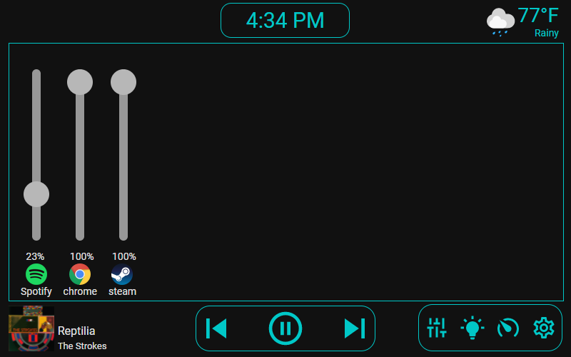
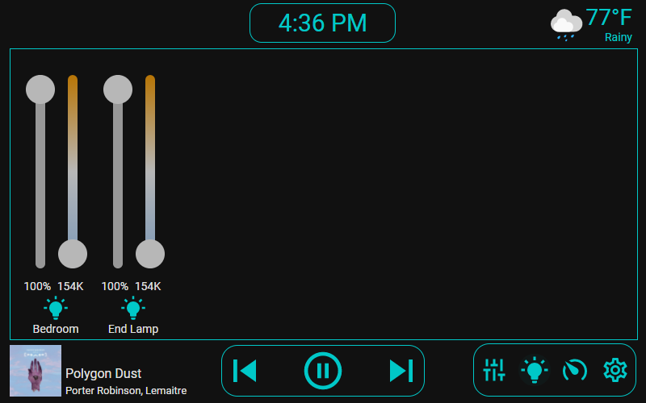

# Desktop Control Panel - Home Assistant Custom Panel

A custom HomeAssistant panel intended to be used in pair with a desktop computer and displayed on a
tablet. Originally designed to work on a RaspberryPi 7" Touchscreen. Based on my previous project,
 [Desktop Control Tablet](https://github.com/gannonprudhomme/Desktop-Control-Tablet)



## Installation (via HACS)

0. The project is added as a custom repository from [HACS](https://hacs.xyz/), so make sure you have that installed first.

1. Add it as a custom repository in HACS:

    a. Go to HACS panel -> Integrations

    b. In the dropdown on the top right, click `Custom repositories`

    c. In the `Add custom repository URL` field, enter `https://github.com/gannonprudhomme/ha-desktop-processes`
    and for `category` enter `Integration`.

    d. The repository should appear as a `New repository` on the `Integration` screen. If it doesn't,
    go to `+ Explore & Add Repositories` then search for it. You'll then need to restart HA.

    e. Then click `Install` to install it into `config/custom_components`

2. Add the following to `configuration.yaml`. Note that this is the bare minimum - there are further
configuration options displayed further down.

```yaml
panel_custom:
  - name: desktop-control
    url_path: desktop-control
    sidebar_title: Desktop Control
    sidebar_icon: mdi:server # This can be any mdi: icon
    module_url: /local/main.js # This is the only required entry - everything else 
    config:
      # Determines which modules to use and their order. Remove any modules that are unwanted.
      # Note that each module needs extra configuration, which you can see below
      modules:
        - desktop_processes
        - light_control
        - pc_stats
        - rpi_backlight

      # Further configuration displayed below
```

## Complete configuration.yaml example

```yaml
panel_custom:
  - name: desktop-control
    url_path: desktop-control
    sidebar_title: Desktop Control
    sidebar_icon: mdi:server
    module_url: /local/main.js
    config:
      weather_name: weather.home
      spotify_name: media_player.spotify_gannon_prudhomme

      # For use with ha-desktop-processes, optional
      desktop_name: desktop_processes.desktop_1 
      
      # For use with ha-rpi-backlight, optional
      pi_brightness_name: sensor.screen_brightness
      pi_power_name: sensor.screen_power

      # Determines which modules to use and their order.
      # First one is the default one / landing page
      modules: 
        - desktop_processes
        - light_control
        - pc_stats
        - rpi_backlight

      # Only if you want to use the light_control module
      lights:
        - name: light.light_group
          priority: 1
        - name: light.corner_lamp
        - name: light.desk_lamp

      # Only if you want to use the pc_stats module
      pc_stats:
        # Hypothetically the values can be any type of sensor, as long as they match up
        # (e.g. temp to temperature, usage to percent)
        cpu_temp: sensor.gannon_sff_amd_ryzen_9_5900x_temperatures_cpu_ccd_average
        gpu_temp: sensor.gannon_sff_nvidia_geforce_rtx_2070_super_temperatures_gpu_core
        cpu_usage: sensor.gannon_sff_amd_ryzen_9_5900x_load_cpu_total
        gpu_usage: sensor.gannon_sff_nvidia_geforce_rtx_2070_super_load_gpu_core
        memory_usage: sensor.gannon_sff_generic_memory_load_memory
```

## Screenshots

### Light Control



## Development

### Setting up HA

1. Install homeassistant
2. ...?
3. `source env/Source/activate` / `env/bin/activate`
4. Run `hass -c config`

### Building and running locally

`npm run dev`, then refresh the window

### Deploying new version

1. `npm run build`
2. Commit & Push
3. Create a new GitHub release.
