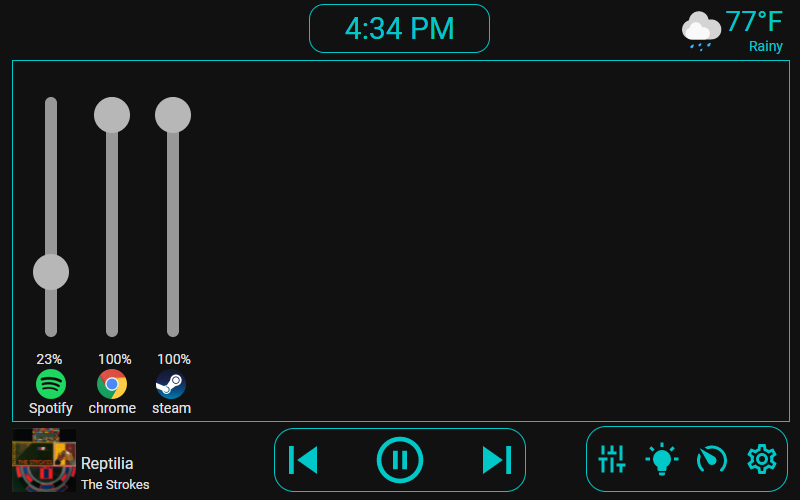

# Desktop Control Panel

A custom HomeAssistant panel originally for use on a RaspberryPi 7" Touchscreen, but will work
on any screen size. Based on my previous project, [Desktop Control Tablet](https://github.com/gannonprudhomme/Desktop-Control-Tablet)



## Complete configuration.yaml example

```yaml
panel_custom:
  - name: desktop-control
    url_path: desktop-control
    sidebar_title: Desktop Control
    sidebar_icon: mdi:server
    module_url: /local/main.js
    config:
      weather_name: weather.home
      spotify_name: media_player.spotify_gannon_prudhomme

      # For use with ha-desktop-processes, optional
      desktop_name: desktop_processes.desktop_1 
      
      # For use with ha-rpi-backlight, optional
      pi_brightness_name: sensor.screen_brightness
      pi_power_name: sensor.screen_power

      # Determines which modules to use and their order.
      # First one is the default one / landing page
      modules: 
        - desktop_processes
        - light_control
        - pc_stats
        - rpi_backlight

      # Only if you want to use the light_control module
      lights:
        - name: light.light_group
          priority: 1
        - name: light.corner_lamp
        - name: light.desk_lamp

      # Only if you want to use the pc_stats module
      pc_stats:
        # Hypothetically the values can be any type of sensor, as long as they match up
        # (e.g. temp to temperature, usage to percent)
        cpu_temp: sensor.gannon_sff_amd_ryzen_9_5900x_temperatures_cpu_ccd_average
        gpu_temp: sensor.gannon_sff_nvidia_geforce_rtx_2070_super_temperatures_gpu_core
        cpu_usage: sensor.gannon_sff_amd_ryzen_9_5900x_load_cpu_total
        gpu_usage: sensor.gannon_sff_nvidia_geforce_rtx_2070_super_load_gpu_core
        memory_usage: sensor.gannon_sff_generic_memory_load_memory
```
